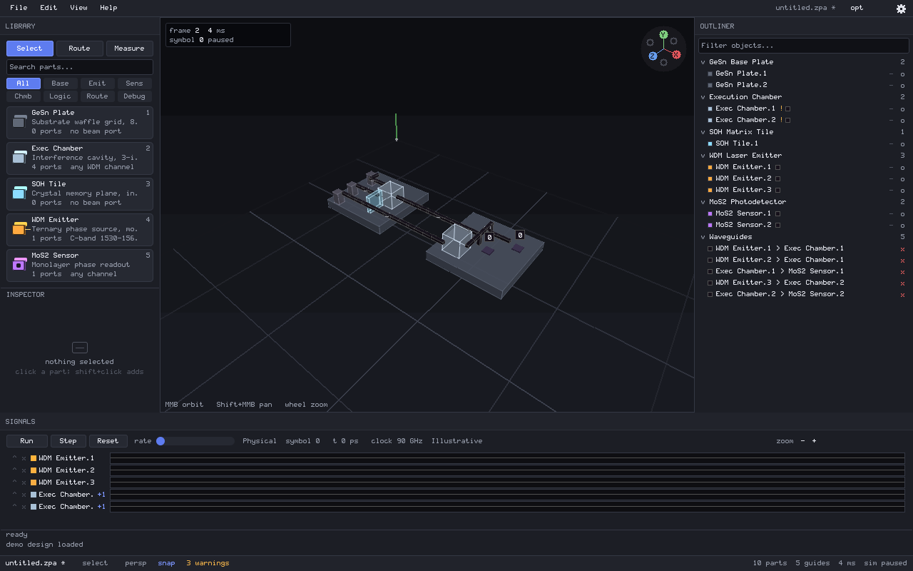
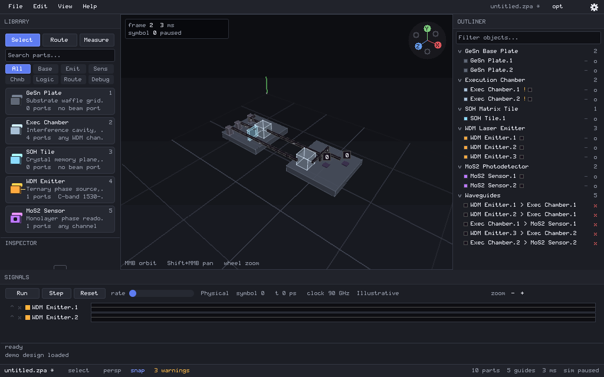
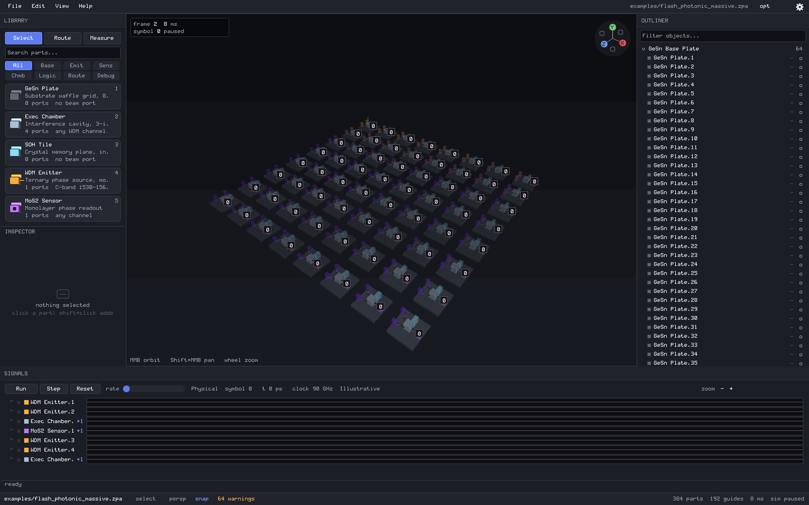

# PrismStudio

### Native CAD and deterministic simulation for exploratory photonic computing

PrismStudio is a native, pure-Zag workbench for designing, inspecting, and
deterministically simulating spatial balanced-ternary photonic processors. It
brings 3D layout, routing, signal inspection, physical-model provenance, and
authorized automation together in one local desktop application.

## See the current workbench



*The current design workspace: searchable component library, 3D viewport,
hierarchical outliner, inspector, and signal timeline.*



*A compact routed reference design, showing the layout, component hierarchy,
and live signal controls in the same native workspace.*



*A larger Flash FIR-imported PCU design in the native workbench, with the
library, outliner, and detector signal timeline visible together.*

## Design the system. Inspect the signal. Keep the evidence.

- **A purpose-built native workbench.** Compose components and waveguides in a
  dark X11 desktop UI with a searchable library, drag-to-place layout,
  inspector, outliner, signal timeline, section view, measurement, snapping,
  grouping, and design warnings.
- **A deterministic design loop.** PrismStudio couples a voxel design-rule
  engine, deterministic 3D waveguide router, and symbolic/phase-aware
  balanced-ternary simulator so a design can be laid out, analyzed, and
  revisited reproducibly.
- **Evidence-first physical modeling.** Schema v2 records 25
  provenance-bearing parameters across emitters, waveguides, chambers, memory
  tiles, detectors, substrates, ports, and material stacks. Unknown stays
  unknown; the simulator does not invent a missing physical value.
- **Automation you can audit.** Native line and MCP interfaces provide
  revision-checked mutations, stable UI control IDs and bounds, live screenshots,
  physical-model inspection, and an append-only local audit trail.

## What you can do today

- Build a photonic design visually, inspect its hierarchy and parameters, and
  route 3D waveguides through the scene.
- Run deterministic software simulation, scrub detector signals in the timeline,
  and cross-highlight the corresponding geometry in 3D.
- Import Flash hardware IR (`.fir`) as a routed photonic design and verify its
  detector results against compiler-recorded balanced-ternary expectations.
- Save, version, recover, export, and undo project edits with transactional
  project operations.
- Review background optimizer proposals for equivalence-verified dead paths and
  constant operations before applying them. Auto-apply is off by default.
- Drive the same project and UI through authorized CLI or MCP automation,
  including physical model/provenance reads and guarded UI activation.

## An honest boundary

PrismStudio is **software for design-model verification**, not a claim of
fabricated or laboratory-validated photonic hardware. The bundled reference
device model is explicitly labeled `Illustrative`; values provided by users,
literature, or measurements retain their own evidence labels.

The production viewport is the CPU renderer and its permanent reference/fallback.
An AMDGPU runtime is present for research, but is experimental, opt-in, and not
certified on the current single-GPU display system. PrismStudio makes no GPU
performance or dispatch-reliability claim.

## Build, run, and verify

The supported compiler is the sibling Zag checkout's self-hosted native compiler.
No C compiler, libc, Xlib, Mesa, LLVM, or Python service is used by PrismStudio.

```bash
./build.sh             # production binary plus safe CPU/X11 checks
./verify.sh safe       # all safe suites with JSON result records
./verify.sh release    # requires a real X11 session
./run.sh               # native X11 workbench
./zagctl repl          # native line protocol
./zagctl mcp           # native MCP server
./zagctl flash import ../flash/examples/photonic_massive.fir
```

`./verify.sh safe` is the everyday source of truth. It exercises the safe build,
engine, persistence, routing, simulation, optimizer, automation, physical-model,
and claim-audit suites; native X11 tests and captures run when `DISPLAY` is
available. GPU memory, submission, and compute checks are separate explicit
research modes, not a hidden prerequisite for the safe result.

## Automation with deliberate authority

Native agents default to `read,inspect,simulate`. Mutation, save, export, local
execution, and admin operations require an explicit `TRITON_CAPS` grant. The
generated local MCP configuration grants `all` deliberately and identifies its
actor; deployments should narrow that value. Requests and denials are appended
to `.triton/audit.log` (or `TRITON_AUDIT`).

Project mutations use `request <idempotency-key> <expected-revision> <command>`.
`zagctl` creates this envelope automatically using the current revision; set
`TRITON_IDEMPOTENCY` to a stable caller key when retrying. MCP clients use the
advertised `triton_mutate` tool or a specialized mutation tool whose schema
requires `idempotency_key` and `expected_revision`. Successful results include
the revision, idempotency key, affected ID, and undo token. Unkeyed mutations
are rejected.

Authorized automation can inspect the live interface with `ui list`, capture it
with `ui screenshot <path.bmp>`, and activate an advertised control with the
revision-checked `ui activate <element-id>` mutation. The widget-generated
catalog reports stable IDs, semantic roles, enabled/active/focused state, and
exact live click bounds. MCP exposes the same contract as `triton_ui_list`,
`triton_ui_screenshot`, and `triton_ui_activate`.

## Physical model and provenance

Help → Physical Model & Provenance opens the project-pinned model browser.
Evidence levels are `Illustrative`, `User-entered`, `Simulated`,
`Literature-derived`, `Measured`, and `Unknown`. Board timing is derived from
the selected model's component response parameters, routed geometry, and
material group index; no frequency is a universal PrismStudio constant.

Legacy schema-v1 projects stay pinned until the user or an authorized agent
explicitly migrates them. Migration retains existing values and marks newly
introduced fields `Unknown` rather than manufacturing evidence.

## Project map

```text
src/main.zag          native X11, headless, agent, and MCP entry point
src/device_model.zag  versioned physical inputs and provenance classes
src/scene.zag         components, ports, occupancy, and optical graph
src/routing.zag       deterministic 3D waveguide router
src/sim.zag           balanced-ternary symbolic/physical simulation
src/optimizer.zag     continuous equivalence-verified optimizer
src/editops.zag       transactional edits, undo/redo, and project format
src/viewport.zag      CPU 3D reference renderer and picking
src/x11.zag           direct X11 wire-protocol client
src/gpu_rt.zag        opt-in direct AMDGPU research runtime
tools/verify.zag      pure-Zag verification orchestrator
evidence/             master-plan ledger and release evidence index
```

The complete implementation and acceptance contract is in
[masterplan.md](masterplan.md); unchecked items remain incomplete even when a
narrower test passes. See [release notes](docs/RELEASE_NOTES.md) for the current
verified scope, [automation and recovery details](docs/FORMATS_AUTOMATION_RECOVERY.md)
for the project and agent contracts, [reference PCU reproduction](docs/REPRODUCE_REFERENCE_PCU.md)
for the maintained workload, and the [evidence index](evidence/README.md) for
the verification record.
