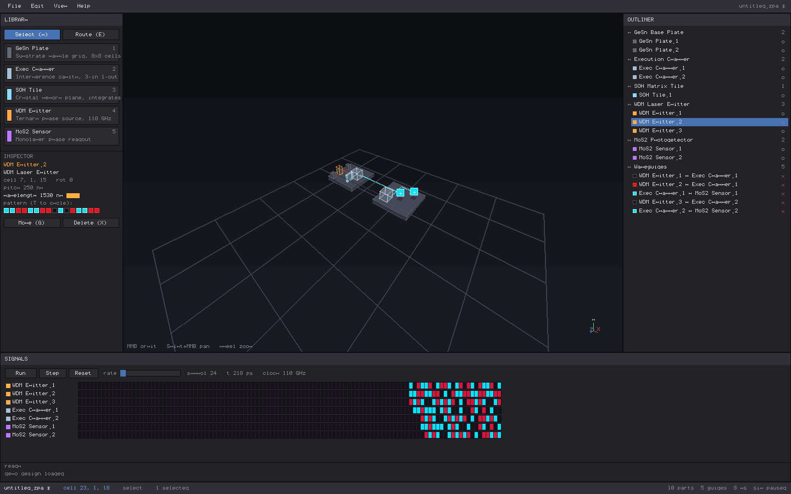

# Zag Photonics Architect

A desktop CAD workbench for spatial optical processors — photonic CPUs built
on native balanced-ternary logic (−1, 0, +1) and continuous-wave interference,
not binary silicon. **The entire application is written in Zag — zero C, zero
libc, zero Xlib.** It is compiled by `znc` (the self-hosted native compiler in
`../zag/zag-poc`) straight to a static x86-64 ELF. The 3D viewport is a
software rasterizer written in Zag (z-buffered triangle fill, ~10 ms/frame at
1440×900), and the window itself is driven by `src/x11.zag`: a pure-Zag X11
client that speaks the wire protocol directly over the server's unix socket
on top of the `_zag_raw_syscall` intrinsic (connection setup with
MIT-MAGIC-COOKIE-1 auth, window + WM_DELETE handling, keyboard mapping,
pointer/key events, banded ZPixmap PutImage blits). `./zagpa --x11-selftest`
round-trips synthetic events through the live server to prove the protocol
both directions.



## Build & run

```bash
./build.sh     # compiles zagpa, runs engine tests + render smoke + X11 selftest
./run.sh       # opens the workbench window
```

Requirements: the Zag repo checked out as a sibling (`../zag/zag-poc/znc`)
and a running X server. Nothing else — no compiler toolchain, no libraries.
`ZNC=/path/to/znc ./build.sh` to override the compiler path.

## Workspace (Blender-style zones)

- **Center — 3D viewport.** Navigable nanometer lattice (1 voxel = 250 nm).
  MMB orbit · Shift+MMB pan · wheel zoom · `F` frame selected.
- **Left — photonic toolbar.** Component library (click or hotkey `1..5` to
  arm, click in viewport to place, `R` rotates the ghost) + inspector for the
  selected part (λ/pattern for emitters, SOH memory for chambers, physical
  delay for waveguides).
- **Right — execution outliner.** Every placed part, grouped by hardware
  layer, with visibility toggles; waveguides listed as `source > sink` with
  live ternary state chips and delete buttons.
- **Bottom — wave-state debugger.** Transport (`Space` play/pause, step,
  reset, rate slider), per-component trit lanes in the strict ternary colors,
  the 110 GHz symbol clock, a cavity-interference oscilloscope for the
  selected chamber, and the console log.

## Hardware library

| Part | Behavior |
|---|---|
| GeSn base plate | 8×8 waffle-grid substrate; everything snaps onto it |
| Execution chamber | reflective cavity, 3 inputs / 1 output; output = saturating balanced-ternary sum of arriving carriers (interference); max 64 per board |
| SOH matrix tile | translucent crystal memory plane; each face-adjacent tile feeds the cavity's previous field back — the chamber becomes a ternary integrator |
| WDM laser emitter | ternary phase source (16-symbol pattern presets, `T` cycles); each emitter gets its own C-band wavelength |
| MoS2 photodetector | monolayer phase discriminator; live trit badge in the viewport |

## Ternary color code (strict)

- **−1** (180° phase) — crimson `(220,20,60)`
- **0** (dark/null) — obsidian `(22,17,27)` with a violet rim for legibility
- **+1** (0° phase) — cyan `(0,229,255)`

## Architecture

The scene is **not** stored as meshes: it is (a) a voxel occupancy lattice
(`src/scene.zag`) used for snapping and design-rule checks, and (b) a directed
graph of optical flow — component ports connected by waveguides routed with
A* + bend penalty over the free lattice (`src/routing.zag`). The simulator
(`src/sim.zag`) compiles that graph into a synchronous dataflow model clocked
at the 110 GHz symbol rate (9.09 ps): guides are delay lines (≥1 symbol per
hop, +1 per 4 lattice cells), chambers interfere, detectors discriminate.
Meshes are derived per frame by `src/viewport.zag`.

```
src/main.zag       entry: X11 loop, --pipe headless protocol, --smoke render,
                   --x11-selftest wire round-trip
src/x11.zag        pure-Zag X11 client (sockets/auth/events/PutImage, no Xlib)
src/workspace.zag  panels + frame orchestration
src/app.zag        App state, zones/splitters, tools, input
src/viewport.zag   software 3D: raster core + component/guide rendering + picking
src/scene.zag      voxel lattice + directed optical graph (the design database)
src/routing.zag    A* waveguide router
src/sim.zag        110 GHz balanced-ternary wave simulator
src/components.zag hardware library (footprints, ports, rules)
src/ternary.zag    trit algebra + strict color code
src/voxel.zag      lattice math, rotation
src/math3d.zag     Vec3, orbit camera, projection, picking rays
src/fb.zag         i64 framebuffer, 2D primitives, BMP/shm writers
src/tiles.zag      viewport tile cache (static scene layer, dirty-rect blit)
src/ui.zag         theme + immediate-mode widgets
src/gpu_rt.zag     pure-Zag AMDGPU runtime (DRM ioctls, GEM, context, CS, fence)
src/rdna.zag       hand-written RDNA1 (GFX10) machine-code emitter
std/               vendored Zag stdlib (list, hashmap, rt)
probe/             engine tests, GPU selftest, scale benchmark, smoke renders
```

## GPU

`src/gpu_rt.zag` is a pure-Zag AMDGPU runtime: it drives the kernel's `amdgpu`
DRM device directly over the `_zag_raw_syscall` intrinsic — **no libdrm, no
Mesa, no C** — the same way `src/x11.zag` speaks to the X server. It opens
`/dev/dri/renderD128`, queries the real device, and allocates CPU-mappable GEM
buffers.

```bash
./zagpa --gpu-info          # real device query over pure-Zag DRM ioctls
./probe/gpu_test            # + GEM alloc/mmap + CPU<->GPU memory round-trip
./probe/gpu_submit_test     # + context, VM mapping, PM4 command buffer, fence
./probe/gpu_compute_test    # + an RDNA1 compute shader run on the shader cores
```

On the dev box this reports the live Radeon RX 5700 (Navi 10, 40 CUs, 2100 MHz)
read straight from `AMDGPU_INFO_DEV_INFO`. When no render node is present every
GPU selftest skips cleanly and the viewport uses the CPU rasterizer with no loss
of function.

**The whole GPU stack is pure Zag — no libdrm, no Mesa, no LLVM, no C:**

- `src/gpu_rt.zag` — device open/query, GEM buffer alloc + mmap, GPU virtual
  address mapping, GPU context, command submission (`AMDGPU_CS`), and fencing,
  all over `_zag_raw_syscall`.
- `src/rdna.zag` — a hand-written RDNA1 (GFX10.1) machine-code emitter. Each
  instruction is built from its documented microcode field layout (VOP1,
  FLAT/GLOBAL, SOPP); no assembler in the loop.

`probe/gpu_compute_test` hand-emits a GFX10 kernel with `src/rdna.zag`, uploads
it to an executable GPU buffer, builds the PM4 to configure the compute pipeline
(`SET_SH_REG` for the `COMPUTE_*` registers) and `DISPATCH_DIRECT`s it, then
verifies the values the **shader cores** wrote back — a full znc-to-silicon
compute path with nothing but Zag in it.

The interactive viewport is still the Zag software rasterizer (it no longer
re-renders unchanged frames — tile cache in `src/tiles.zag` — which is what makes
it ≈6 ms/frame steady-state at 5k+ components). Moving per-pixel rasterization
onto the cores is the next increment: it needs a multi-lane addressing kernel
(per-thread global-id arithmetic) on top of the verified single-thread path.

## Compiler notes

`NOTES.md` documents the `znc` compiler work done upstream while building this:
a real heap allocator (segregated free lists + a writable BSS segment, replacing
the leak-forever bump allocator), hex integer literals, a word-at-a-time
`memcpy`, and the `_zag_raw_syscall` intrinsic the X11 and GPU clients are
written against — all preserving the self-hosting fixpoint and the differential
x86/arm64 suite.
